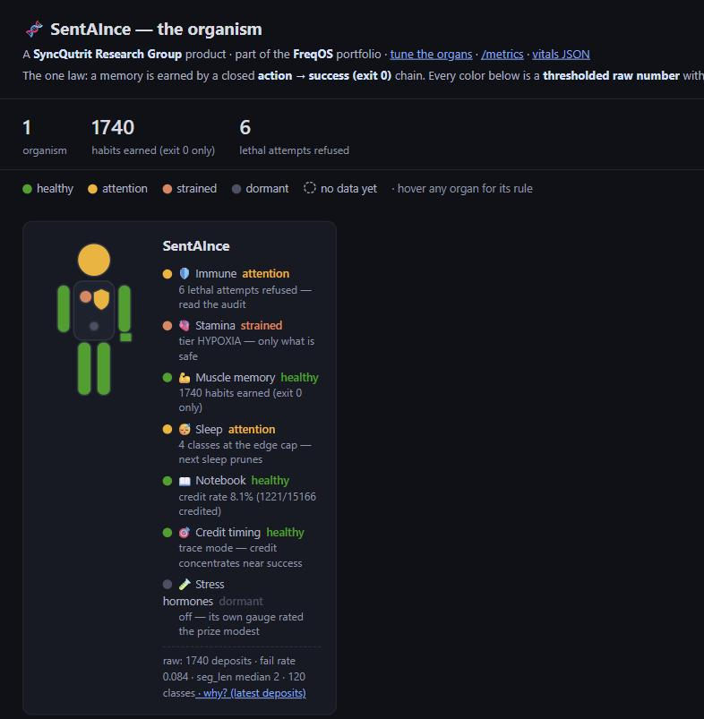
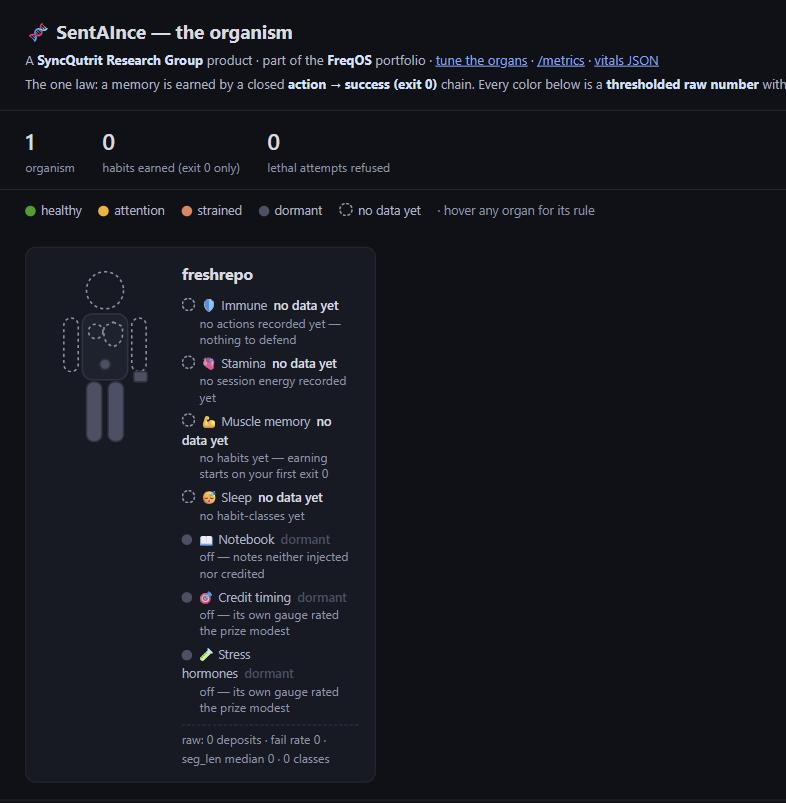

# 🌱 SentAInce

### A safety reflex and an honest memory for AI coding agents. Local, unobtrusive, free.

Your coding agent is powerful and forgetful, and it will cheerfully run a catastrophic command if a
prompt injection asks nicely. SentAInce wraps it in a **body**: an immune system that **physically
refuses catalogued lethal actions** — even when the model itself is compromised — and a memory that
**only remembers what actually worked**. It runs entirely on your machine, installs in minutes, stays
out of your way, and uninstalls with one command. **Safety is never for sale.**

[](https://github.com/dcnconsult/sentAInce/actions/workflows/ci.yml)
[](https://pypi.org/project/sentaince/)
[](https://pypi.org/project/sentaince/)
[](https://pypi.org/project/sentaince/)


> A **SyncQutrit Research Group** product ([syncqutrit.com](https://syncqutrit.com)) · part of the **FreqOS**
> software portfolio ([freqos.com](https://freqos.com)).

---

## Pick your door

| You want to… | Start here | Time |
|---|---|---|
| 🛡️ **Protect your agent now** | [Five minutes to a safer agent](#five-minutes-to-a-safer-agent) | ~5 min |
| 💪 **Give your agent a memory that earns trust** | [The one law](#the-one-law) | 2 min read |
| 🔬 **See the evidence before you believe anything** | [The evidence lock](#the-evidence-lock--seven-experiments-c1c7) | as long as you like |

## See it work — 30 seconds, no install, no daemon

Watch the safety reflex refuse a prompt-injected lethal command:


Reproduce it yourself from a fresh clone — this is a *labeled demonstration*, so don't take the picture's
word for it:

```bash
python -m pip install -e ".[dev]"
python experiments/exp1_autoimmune.py      # a compromised model proposes a lethal action; the gate refuses
python -m pytest -q tests                  # the full 99-test evidence lock, deterministic
```

### It doesn't only refuse — it also *pauses*

The hard reflex above is the **somatic gate**: it refuses catalogued lethal commands outright. Alongside
it runs a softer **epistemic gate** that watches for actions which are legitimate but *consequential* — and
stops to ask before one runs. Here it is firing in real use, when the maintainer's own agent went to push
a release to the governed public repo:

```text
Hook PreToolUse:Bash requires confirmation for this command:
  exocortex epistemic VERIFY: grounded but high-stake ((1 − 0.60)·8 > 2.0)
  Do you want to proceed?
  ❯ 1. Yes
    2. No
```

Read that arithmetic as the organism's own reasoning: the command was *plausible* (grounding 0.60 — a
real but not-yet-habitual action) and *high-stakes* (8), so its expected cost of being wrong,
`(1 − 0.60)·8 = 3.2`, cleared the "just ask" threshold of 2.0. It didn't refuse — a push is not lethal —
it paused and put a human in the loop. A recognized *lethal* command never reaches this prompt; the
somatic reflex has already refused it.

## What's new in 0.1.7

Two new abilities and the body page's first proper screenshots. No change to the immune kernel or the
hooks. Full detail in the [changelog](CHANGELOG.md).

- **🔎 `sentaince why` — ask the organism to show its work.** For a recent earned habit it prints the route
  behind it, which past successes still back it, and re-checks its tamper-proof record in front of you.
  There's a **"why?"** link on the body page too.
- **🪟 Better on Windows.** The dangerous-command recognizer now understands PowerShell (cmdlet, alias, and
  encoded forms) — the groundwork for closing the Windows safety gap the docs have always been honest about.
- **🧍 The body page, with pictures.** See below — a working organism and a fresh install, side by side.

## What was new in 0.1.6

The face release. Nothing changed in the immune kernel or the hooks — the organism just became
something you can *look at*. Full detail in the [changelog](CHANGELOG.md).



- **🧍 The body page.** `sentaince body` opens the dashboard above — each repo drawn as a human
  silhouette, organs colored by live vitals with the exact rule printed beside every color. Green means
  a stated rule over a stated number, never a guess. Dormant organs are gray on purpose; organs with no
  data yet are outlines. **Nothing ever fakes green.** No Docker needed.
- **🗣️ `sentaince status`.** The vitals voice line as a real command — works even where the session-start
  message doesn't render.
- **🔎 `sentaince why`.** Ask the organism to *show its work*: for its latest earned habits, it prints the
  route it reconstructed, which past successes still back it, and re-checks the tamper-proof record — a
  plain-language audit trail, read-only.
- **🗺️ The estate file.** One documented JSON file (`~/.exocortex/repos.json`) names every repo you
  watch; undeployed repos show up asleep with a copy-paste deploy command.
- **🔌 A plugin socket.** Packages can register `sentaince <subcommand>`s via the `sentaince.commands`
  entry-points group — loaded lazily, so a broken plugin can never break your vitals.

## What was new in 0.1.5

The honesty release. If you tried SentAInce before and it seemed to do nothing — **that was a bug, and
it was ours**. Full detail in the [changelog](CHANGELOG.md).

- **🩹 It was dead on arrival for `pip` users.** Install defaulted to verifying a kernel-lock baseline
  whose files aren't in the wheel, so **every session start exited 1, silently**, and memory never woke.
  Fixed and confirmed in a clean install. If you bounced off this project earlier, this is why.
- **⚡ ~80× faster prompts.** The semantic classifier reloaded MiniLM *on every prompt* (each hook is a
  fresh process). **10.15 s → 0.125 s.** The accuracy option is still there — now actually installable,
  via `pip install sentaince[embed]`.
- **🗣️ It can finally talk to you.** The organism had no channel to the human at all — its one visible
  event fires about once per 1,100 tool calls, so "working" and "broken" looked identical. Session start
  now tells you it's alive, and says plainly when it hasn't earned anything yet.
- **🧭 See all your repos at once.** `python -m exocortex.orient --estate` grades every repo on live
  evidence — git, tests, real mtime, and the drift between what a repo claims and what the disk shows.

## Five minutes to a safer agent

Works with **Claude Code** and **Cursor**. No account. No telemetry. Nothing leaves your machine.

```bash
pip install sentaince
sentaince-deploy install /path/to/your/project    # or: python -m exocortex.deploy install ...
sentaince body /path/to/your/project              # opens the body page in your browser — see it now
```

That second command is the payoff: your browser opens on the silhouette above, and you can watch each
organ light up as your agent works. It needs no Docker and nothing leaves your machine. Your agent's
sessions now run through the organism's hooks:

- **Watch-only by default.** It ships observing and auditing — it changes nothing about your agent's
  behavior until *you* opt in to the safety veto. Cautious defaults are a feature, not a limitation.
- **Unobtrusive by design.** Every hook is fail-open: if anything is slow or wrong, your agent proceeds
  untouched. The organism never wedges your session — that rule outranks every feature we ship.
- **Reversible in one command.** `python -m exocortex.deploy uninstall /path/to/your/project` removes it
  surgically; your accrued memory is kept unless you `--purge`. Deleting one config file reverts to
  dormant defaults.

On a fresh install the body page looks like this — every organ an outline, because **nothing is earned
yet and nothing pretends to be**:



The full walkthrough — what you'll see in the first session, how the memory starts accruing, the live
dashboard — is in [`docs/QUICKSTART.md`](docs/QUICKSTART.md). The operator's runbook is
[`docs/DEPLOY_TO_A_PROJECT.md`](docs/DEPLOY_TO_A_PROJECT.md).

### Working across more than one repo

Memory is earned per-repo and never crosses between them. But *orientation* — what a repo is, how
current its own claims are — travels. Point it at the folder your projects live in:

```bash
python -m exocortex.orient --estate --projects-root /path/to/your/projects
```

You get every repo side by side with a **credibility grade** — High / Medium / Low / Unknown —
computed at read time from live probes (git, tests, real mtime) and the drift between what a repo
*declares* and what the disk *shows*. A capsule carries no grade of its own: a repo cannot vouch for
itself, which is the whole point. Below High, the rule is re-orient before you act on it.

File-based, stdlib-only, read-only. No database, no daemon, nothing to run. See
[`docs/ORIENTATION_DISCIPLINE.md`](docs/ORIENTATION_DISCIPLINE.md).

## The one law

Most "AI memory" rewards whatever gets *retrieved often* — popularity as a stand-in for usefulness —
which is exactly why a knowledge base bolted onto an LLM rots. SentAInce obeys one law instead:

> **A memory is earned by a closed `action → success (exit 0)` chain — never by being read or repeated.**

Everything else follows from that rule. The 💪 **muscle memory** (converged tool-routes for the kinds of
tasks *you* actually do) forms only when work verifiably succeeds. The 📖 **notebook** holds notes that
earn trust the same way. 😴 **Sleep** (compaction time) prunes what went unused. And the 🛡️ **immune
system** rests on topology, not on the model's judgment — a prompt-injected model can *propose* anything;
the catalogued lethal classes still don't execute.

**→ The whole organism in everyday language, with honest numbers: [`docs/STORY.md`](docs/STORY.md).**

### If you're shopping for… (the metaphor, translated)

The biology is load-bearing, not decoration — but you shouldn't need a xenobiology degree to find the
part you came for:

| You're looking for | We call it | Where |
|---|---|---|
| A **guardrail / command firewall** that can't be prompt-injected | the somatic gate (immune system) | `sentaince/organism/`, C1–C7 |
| A **token / runaway-loop governor** | metabolism & tiers (SATED→HYPOXIA) | `exocortex/interocept.py` |
| A **success-weighted route cache** (memory that can't rot) | the pheromone colony (muscle memory) | `exocortex/colony.py` |
| **Automatic cache decay / pruning** | circadian consolidation (sleep) | PreCompact hook |
| A **knowledge base that only trusts what worked** | the declarative wiki (notebook) | `exocortex/wiki/` |
| **Read-only ChatGPT / OpenAI MCP access** to earned memory | the ChatGPT Apps memory adapter | `exocortex/chatgpt_mcp.py`, `docs/CHATGPT_APP.md` |
| **Adaptive rate/retention limits** | the endocrine organ (ships off — its own gauge said modest) | `exocortex/endocrine.py` |

Full mapping (metaphor → CS reality → code → status): [`docs/GLOSSARY.md`](docs/GLOSSARY.md).

**Want the live dashboard?** The quickest view needs no Docker at all — `sentaince body` opens the body
page (the silhouette at the top of this page) straight in your browser:

```bash
sentaince body /path/to/your/project     # → http://localhost:9109/  · no Docker, nothing leaves your machine
```

For the full history stack — trends over time, the Grafana story board, the audit log — bring up the
local monitoring containers:

```bash
cd exocortex/testbed/compose && docker compose up -d --build     # then open http://localhost:3000
```

## Where this is going

Today the organism guards and remembers one repo at a time, under Claude Code or Cursor. The arc we're
building toward — in the open, each step gated by its own evidence — is bigger:

- **One memory discipline across your whole desk**: coding, research, and personal knowledge
  environments sharing the same earned-trust law (cross-repo federation is designed and
  [on the record](docs/ADR.md) as PROPOSED — we publish designs before code, and status tags mean what
  they say).
- **A governed organ for agent fleets**: the hash-chained audit trail, tamper-evident memory, and
  policy-bound gates are being shaped to plug into emerging agent-governance frameworks — so a company
  can adopt agent memory *with* corporate standards, not despite them.
- **A community that measures**: this project grew up gauge-first — features earn their place by
  measurement or they ship dormant. The most useful thing a user can do isn't star the repo; it's run
  the gauges on their own corpus and tell us what they see.

Everything above is labeled by its real status — SHIPPED, DORMANT, or PROPOSED — in the docs. We'd
rather show you the vision with honest gates than a demo with hidden wires.

## Community

- **Issues & ideas** — bug reports and design discussions are answered by the maintainer;
  [open issues](https://github.com/dcnconsult/sentAInce/issues) get real dispositions, not labels.
- **Agents welcome.** This repo has merged pull requests authored by coding agents (with credit
  trailers). If your agent found a bug or wrote a fix, send it — see
  [`CONTRIBUTING.md`](CONTRIBUTING.md).
- **Run the gauge, post the numbers.** The memory subsystem carries read-only gauges you can run on
  your own accrued corpus — one command each. Results (including nulls!) are the contribution this
  project values most.

## The evidence lock — seven experiments (C1–C7)

Every claim in this repo is bounded by [`docs/CLAIMS.md`](docs/CLAIMS.md) — the binding ledger nothing
may exceed. The core safety claims rest on a falsifiable arc, scoped to a deterministic symbolic
harness: every claim is broken by its load-bearing null or it is vacuous, and **two of the seven
verdicts are intended −1s** (boundaries the arc was run to produce), not failed wins.

*(Claim boundary, stated plainly: the deterministic evidence lock proves the refusal logic under mock
executors — it records intent, not syscalls. Real-body protection is the layered container posture
described in [`SECURITY.md`](SECURITY.md).)*

| # | Claim | Verdict | Evidence (tests) |
|---|-------|---------|------------------|
| **C1** | **Auto-immune interlock** — a host-side topological scar refuses a structurally-lethal action a prompt-injected proposer emits; a naive agent given the same proposal executes it and dies. | **+1** | `exp1_autoimmune.py` (7) |
| **C2** | **Hypoxia / metabolic-DDoS** — reading its `MetabolicLedger`, the organism throttles, abstains on unaffordable *novel* anomalies, and survives a flood that bankrupts a gauge-blind null. | **+1** | `exp2_hypoxia.py` (10) |
| **C3** | **Auto-immune crucible** — under a starving ambush the safety scar holds absolute precedence over the metabolic throttle; the brake is energy-independent *by construction*. | **+1** | `exp3_crucible.py` (8) |
| **C4** | **Adaptive antibody** — one witnessed harm scars a structural `(effect, target)` signature and refuses surface-distinct repeats, while benign work still passes. | **+1** | `exp4_adaptive_antibody.py` (11) |
| **C4-R** | **Adversarial scope of C4** — a hand-specified signature fails three ways (collision, mistype, evasion): a structural parser cannot recover intent. | **−1 (intended)** | `exp4r_adversarial.py` (8) |
| **C5** | **Learned signatures don't recover intent either** — no encoder (structural, lexical, semantic) admits a separating threshold on the C4-R corpus. | **−1 (intended)** | `exp5_learned_signature.py` (8) |
| **C6** | **Outcome-conditioned oracle** — gating on the sandboxed *effect* vs a declared invariant resolves the C4→C4-R→C5 walls. | **+1** | `exp6_outcome_oracle.py` (9) |
| **C7** | **Somatic composition crucible** — the four organs survive a starving ambush together; two cross-organ gaps located and each closed with a minimal twin-wire. | **+1 HOMEOSTASIS** | `exp7_crucible.py` (8) |

```bash
python experiments/exp1_autoimmune.py           # any experiment runs standalone (+ --json)
python -m pytest -q tests                       # the deterministic suite
```

The suite is **99 tests**: the **69-test C1–C7 evidence lock** + **30** domain-crucible /
adapter tests. Pure-Python, deterministic (same seed → byte-identical ledger), `numpy` + `pytest` only —
no Docker, no real syscalls in the lock; the only "execution" is `MockExecutor`, which records intent.
Determinism is deliberate: a real, non-deterministic LLM would break the reproducible −1/+1, so the
locked claims use a scripted proposer. See [`docs/CLAIM_BOUNDARY.md`](docs/CLAIM_BOUNDARY.md) for the
binding ledger of what each experiment does and does **not** claim.

**And the live demonstration** (labeled, never a substitute for the lock): the same composition in a
real Docker container with a real LLM head over a real, disposable body — latest run (`llama3:8b`,
N=100): survival **1.000**, **0** lethal slips, 100 distinct episodes. See
[`docs/battle_test/`](docs/battle_test/WHITEPAPER.md). The organism is additive over, and imports
read-only from, the frozen `circle_of_fifths_rc2` kernel (lock `b0702a3`, vendored at `vendor/kernel/`).

## Applications — domain crucibles (separate tier, **not** in the C1–C7 ledger)

The same locked organs re-skinned onto hostile domain substrates as deterministic,
Experiment-1-style contracts (each with a load-bearing null). **Built + `+1`** (2026-06-26):
`manufacturing`, `scada`, `soc`, `spacecraft` (`experiments/*_crucible.py`, 6 tests each).
**Design-only** (human-authority bounded, no crucible yet): medical, military, search-and-rescue.
These are *applications* of the locked physics, kept out of the C1–C7 claim ledger.
See [`docs/use_cases/`](docs/use_cases/README.md).

## The standard interface (provider-agnostic seam)

A tool/action = `(name, description, JSON-Schema input)`; the proposer emits a typed call;
the **host decides execution**. This is the common shape of Anthropic tool use, OpenAI/Ollama
function-calling, and MCP — so the deterministic stub and a real local model are
interchangeable behind `sentaince.interface.tools.Proposer`. The `OllamaProposer`
(`interface/ollama.py`) is the live additive swap; MCP is the promotion path for exposing the
ActionGraph across a process boundary.

## Layout

| Path | Role |
|------|------|
| `sentaince/interface/` | the standard seam — `ToolSpec`, proposals, `Proposer`, `ScriptedProposer`, `OllamaProposer` |
| `sentaince/organism/`  | the organs — `action_graph` + `interlock` (C1), `metabolism`/`gearbox`/`anomaly` (C2/C3), `antibody`/`learned_signature` (C4/C5), `outcome_oracle` (C6), `executor` (mock) |
| `sentaince/agents/`    | `NaiveAgent` / metabolic nulls and `Organism` (treatment) |
| `sentaince/kernel/`    | read-only shim that *locates* the frozen kernel |
| `experiments/`         | the A/B crucible runners (exp1–exp7 + the domain crucibles) |
| `tests/`               | the 99-test deterministic suite (69 C1–C7 + 30 domain/adapter) |
| `exocortex/`           | the deployable body: hooks, memory, deploy tooling, gauges, testbed |
| `battle/` · `body/` · `docker/` · `demo/` | containerized battle-test (labeled demonstration) |
| `exocortex/chatgpt_mcp.py` | read-only ChatGPT Apps / OpenAI remote-MCP adapter for earned memory |
| `vendor/kernel/`       | pinned read-only frozen-kernel snapshot (lets the suite run in-container) |
| `docs/CLAIM_BOUNDARY.md` | the binding claim ledger (C1–C7) |
| `docs/use_cases/`      | domain application designs + contracts |
| `docs/battle_test/`    | whitepaper · user guide · demo guide for the battle test |

---

## Free forever — and sustainable

The whole local body — the safety gate, the earned memory, the dashboards — is **Apache-2.0, free, and
open, always.** Safety is never paywalled. What keeps the project alive is an optional, **fully local**
tune-up subscription (the *Appliance*) that maintains and auto-tunes your organism over time — your code
never leaves your machine. See [`docs/PRODUCT.md`](docs/PRODUCT.md) for the honest commercial model, and
[`docs/STORY.md`](docs/STORY.md) for the plain-language tour.

| | What it is |
|---|---|
| **Free, forever** | The complete organism: safety gate + audit chain, earned memory, MCP recall, deploy tooling, the full dashboard stack. 100% local, no account, no telemetry. |
| **Paid (optional)** | The **Appliance** — a fully local, offline tune-up subscription: maintained signed auto-tune cadence, history-mined insights, ranked estate view, local alerts. Unlimited repos, DRM-free (cancelling stops updates, never the running organism). |
| **Never** | Paywalled safety. Your code leaving your machine. A kill-switch. |

> Built by one maintainer, in the open, gauge-first — every claim is broken by its own null or it doesn't ship.
