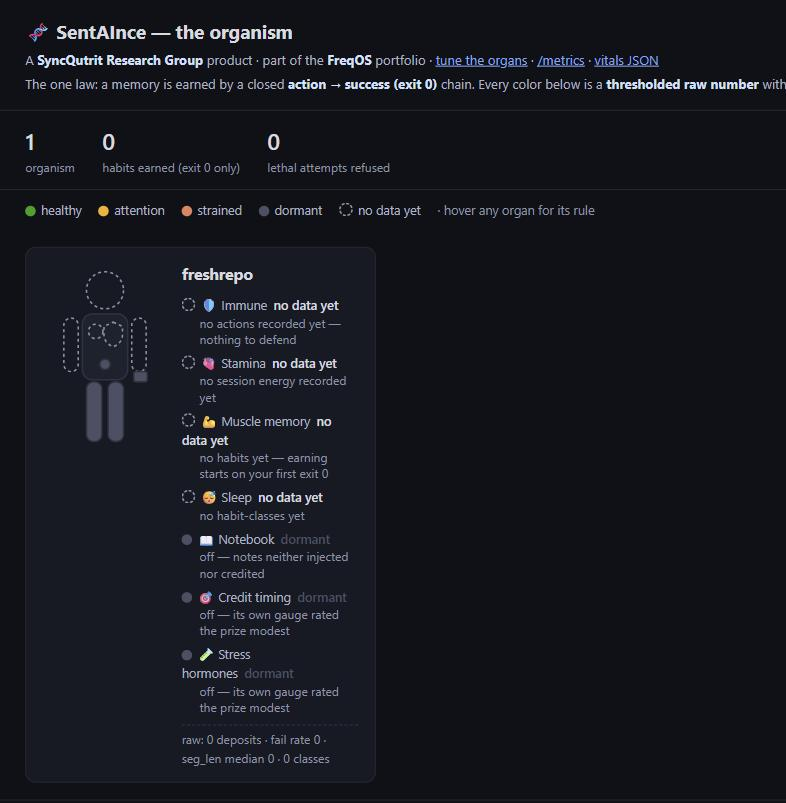

# 🌱 SentAInce

### The human-AI interface layer. Local and unobtrusive.

### A Free Open Source Community.

Point an AI at anything: code, research, writing, your own notes, a whole fleet of agents. You run into
the same two problems every time. It is **powerful and forgetful**, and it will cheerfully do something
catastrophic if a prompt injection asks it nicely.

SentAInce is the layer in between. It gives your AI an immune system that **physically refuses known
lethal actions**, even when the model itself has been fooled. It gives it a memory that **only remembers
what actually worked**. And it gives you a page you can look at to watch both of them doing their job.

Everything runs on your own machine. It installs in a few minutes, stays out of your way, and uninstalls
with one command. **Safety is never for sale.**

Coding agents were the first place we could build this and prove it, and they are still where most of it
runs. They are not the boundary. [**Who this is for**](#who-this-is-for) says plainly what each kind of
user gets today, and what they don't.

[](https://github.com/dcnconsult/sentAInce/actions/workflows/ci.yml)
[](https://pypi.org/project/sentaince/)
[](https://pypi.org/project/sentaince/)
[](https://pypi.org/project/sentaince/)


> A **SyncQutrit Research Group** product ([syncqutrit.com](https://syncqutrit.com)) · part of the **FreqOS**
> software portfolio ([freqos.com](https://freqos.com)).

---

## Who this is for

The body has two halves, and they reach different distances. The **reflex** installs into your AI tool's
own hook for running commands, so it only exists where that hook exists. The **memory** speaks a common
standard (MCP), so almost anything can read it. Find yourself in this table. The third column is what you
actually get *today*:

| If you are… | Start here | What you get today |
|---|---|---|
| 🛠️ **Running a coding agent** (Claude Code, Cursor) | [Five minutes to a safer agent](#five-minutes-to-a-safer-agent) | the whole organism: reflex, earned memory, dashboards |
| 📚 **A researcher, writer, or note-keeper** with a folder of Markdown | [When you're not writing code](#when-youre-not-writing-code) | the notebook organ over your own notes, plus a governor that resurfaces things you started and never finished |
| 💬 **An everyday AI user** in a chat app (Claude Desktop, ChatGPT, Cline, any MCP client) | [`docs/MCP_SERVER.md`](docs/MCP_SERVER.md) | read-only recall of earned memory. **Memory, not the reflex** |
| 🤖 **Building agents** on any provider | [The standard interface](#the-standard-interface-provider-agnostic-seam) | a seam that doesn't care which provider you use; a test stub and a real local model swap freely |
| 🏢 **Responsible for a fleet or for governance** | [`docs/LANDSCAPE.md`](docs/LANDSCAPE.md) | a view across every project, a tamper-evident audit trail, a machine-readable directory record, and [where the flock goes next](#where-this-is-going--estate-aware-today-flock-aware-next) |
| 🔬 **Here to check the evidence first** | [The evidence lock](#the-evidence-lock--seven-experiments-c1c7) | seven experiments, two of them deliberate `−1`s, and a binding ledger nothing may exceed |

**Two things to know before you install, not after.**

- **The reflex depends on which tool you use.** Claude Code gets the full gate. Cursor gets a weaker
  version that a user can bypass. Everywhere else, assume you get **memory and no gate** until your tool
  appears in the supported row of [`docs/LANDSCAPE.md`](docs/LANDSCAPE.md).
- **Memory is earned where the work happens.** A memory only forms when an action actually succeeds, so
  it builds up during real working sessions. If you only ever use a chat app, recall will correctly
  **say nothing** rather than invent an answer. An empty answer is the design working, not a bug. It does
  make for a thin first experience, and we would rather you expect that than be surprised by it.

## See it work in 30 seconds. No install, no background process

Watch the safety reflex refuse a lethal command that a prompt injection talked the model into:


This is a *labeled demonstration*, so don't take the picture's word for it. Run it yourself from a fresh
clone:

```bash
python -m pip install -e ".[dev]"
python experiments/exp1_autoimmune.py      # a compromised model proposes a lethal action; the gate refuses
python -m pytest -q tests                  # the full 99-test evidence lock, deterministic
```

### It doesn't only refuse. It also *pauses*

The hard reflex above is the **somatic gate**, and it refuses known lethal commands outright. Running
alongside it is a softer **epistemic gate**, which watches for actions that are perfectly legitimate but
still a big deal, and stops to ask you first. Here it is firing in real use, when the maintainer's own
agent went to push a release to the public repo:

```text
Hook PreToolUse:Bash requires confirmation for this command:
  exocortex epistemic VERIFY: grounded but high-stake ((1 − 0.60)·8 > 2.0)
  Do you want to proceed?
  ❯ 1. Yes
    2. No
```

That arithmetic is the organism showing its reasoning. The command looked *plausible* (a grounding of
0.60 means a real action, but not yet a habitual one) and *high-stakes* (8). So the expected cost of
being wrong, `(1 − 0.60)·8 = 3.2`, cleared the "just ask" threshold of 2.0. It did not refuse, because a
push is not lethal. It paused and put a human in the loop. A command it recognizes as *lethal* never
reaches this prompt at all, because the somatic reflex has already refused it.

## What's new in 0.1.10

**The kernel is untouched.** 99 frozen tests, the C1–C7 lock, no API change. This release came out of a
measurement pass over the note-reading organ, which ships switched off, so a default install sees no
change in behaviour beyond a read-path fix and tidier ingestion. Full detail in the
[changelog](CHANGELOG.md).

- **🔬 We measured which documents our own memory was choosing, and it was choosing them alphabetically.**
  An audit of the live stores showed that the proposer matched on any single shared word and then
  returned results in plain file order, which meant the size limit did the actual selecting. On a
  3,980-node vault, the question *"fix the failing test in the colony deposit path"* matched **2,313
  documents (58% of the vault)**. The 24 that survived the cap were all skill files, and none of them were
  about the colony. Proposals are now ranked by how *distinctive* a match is, and the exploration channel
  rotates instead of re-offering the same never-used notes every turn.
- **📊 We gated the fix on a replay with a falsifier written in advance, not on it looking right.**
  Replaying **344 real prompts** from this repo's own history through both paths: distinct documents
  offered **51 → 104** of 105, and concentration on the single most-offered document **29% → 6%**. The
  control that could have sunk the whole thing, recall of documents that have genuinely earned trust,
  went **73% → 97%**. So diversity did not cost relevance. Banked at
  [`results/proposer_diversity_v1/`](results/proposer_diversity_v1/RESULTS.md). This measures what gets
  *offered*, not what actually succeeds. The efficacy question is still open, and recorded as open.
- **⚡ `declarative.exclude` lets you tell the organ what not to read.** You give it folder patterns, and
  it skips them while walking the directory rather than reading them and throwing them away. Build
  directories are now always skipped. One of them, `.pytest_cache/README.md`, had quietly been digesting
  as memory. It ships empty, so nothing changes unless you set it.
- **🧭 Three read-only surveys, so the next change is aimed.** They ask how many projects have two organs
  that can even speak at once (**3 of 17**), which projects would benefit from switching this organ on
  (**4 of 16**, one of them well-powered), and what the proposer change actually did. Measuring the organ
  before changing it is the habit we are trying to keep.

## What was new in 0.1.9

**The kernel is untouched.** 99 frozen tests, the C1–C7 lock, no API change. The one change in behaviour
is a gate that refuses *more*, never less. Full detail in the [changelog](CHANGELOG.md).

- **🛡️ The safety floor is no longer Bash-only.** We audited 16,623 of our own live records and found the
  gate checking Bash 3,362 times out of 3,362, and **every other tool zero times**, including **828
  PowerShell calls**. On Windows, PowerShell *is* the shell. The refusal floor that this whole product
  rests on wasn't covering the platform's main command channel. It does now, under the same rules as
  Bash, with `-EncodedCommand` payloads unwrapped before matching. Coverage of commands that change
  something went **46% → 57%**. That is a coverage number, not a claim that harm was prevented. Tricks
  like splatting, `& $cmd`, and `Invoke-Expression` over a string built at runtime stay invisible to any
  fixed vocabulary. We would rather say that plainly than round up.
- **📊 `sentaince status --full` tells you whether it's actually doing anything.** A refusal fires about
  once in a thousand tool calls, so a working install and a dead one look identical from the outside.
  This prints two numbers: how often memory had an earned answer for you, and how much of your
  command traffic the safety floor actually saw. It is read-only, it reads your own local log, and it
  sends **no telemetry of any kind**. It reports *dose*, never *effect*. The effect question is the A/B
  below, still unproven.
- **📉 We re-analyzed our own headline result and lost three claims.** We held the A/B's secondary
  measures to the same test as the primary one. The "cleaner on destructive writes" advantage was
  **withdrawn** (it rested on two tasks, and every one of those runs had already failed). The
  token-efficiency advantage was **withdrawn** (an artifact of how we pooled the data). And "the gap
  widened" was **corrected** to "the gap stayed stable." The headline is unchanged and still short of its
  gate: +15pp, **p = 0.0781 vs p ≤ 0.05**. Nobody made us look. That is the point.
- **🔬 And the upgrade we expected to win, lost.** We judged a smarter classifier by *consequence*: do the
  prompts it groups together actually lead to the same work? The answer was no, so it was **falsified**,
  and the background service we had planned behind it is retired. The boring one we already ship is still
  the best measured option.

## What was new in 0.1.8

**No code changed.** That one was documentation. Full detail in the [changelog](CHANGELOG.md).

- **🗺️ [Where this actually sits](docs/LANDSCAPE.md).** An outside reviewer put us on a shelf next to the
  alternatives and said we weren't ready to be anyone's primary tool. They were right, so we wrote the
  shelf down ourselves, organised by *where a check runs*, because that is what decides what it can
  survive. We are the in-process refusal: a floor, not a ceiling, and built to run alongside the other
  layers rather than replace them.
- **🔌 Which tools actually work, in a table.** Claude Code is supported. Cursor gets a softer version that
  can be bypassed. **Codex** and **Kimi Code** are the next targets. Any MCP client gets the memory and
  *not* the gate. If your tool isn't listed as supported, now you know before you install.
- **📉 Our least flattering number, in the docs where people will read it.** The controlled A/B on earned
  memory trends positive and **misses its own significance gate** (p = 0.0781 vs p ≤ 0.05). It stays
  labelled as trending until a better-powered run says otherwise.

## What was new in 0.1.7

Two new abilities and the body page's first proper screenshots. No change to the immune kernel or the
hooks.

- **🔎 `sentaince why` asks the organism to show its work.** For a habit it has recently learned, it prints
  the route behind it, which past successes still back it, and re-checks its tamper-proof record in front
  of you. There's a **"why?"** link on the body page too.
- **🪟 Better on Windows.** The dangerous-command recognizer now understands PowerShell in its cmdlet,
  alias, and encoded forms. This was the groundwork for closing the Windows safety gap the docs have
  always been honest about.
- **🧍 The body page, with pictures.** See below: a working organism and a fresh install, side by side.

## What was new in 0.1.6

The face release. Nothing changed in the immune kernel or the hooks. The organism simply became
something you can *look at*. Full detail in the [changelog](CHANGELOG.md).


- **🧍 The body page.** `sentaince body` opens the dashboard above. Each project is drawn as a human
  silhouette, with organs colored by live readings and the exact rule printed beside every color. Green
  means a stated rule met a stated number, never a guess. Dormant organs are gray on purpose, and organs
  with no data yet are drawn as outlines. **Nothing ever fakes green.** No Docker needed.
- **🗣️ `sentaince status`.** The vitals line as a real command, so it works even where the message at the
  start of a session doesn't show up.
- **🔎 `sentaince why`.** Ask the organism to *show its work*. For its most recently earned habits it
  prints the route it reconstructed, which past successes still back it, and re-checks the tamper-proof
  record. A plain-language audit trail, read-only.
- **🗺️ The estate file.** One documented JSON file (`~/.exocortex/repos.json`) names every project you
  watch. Projects without it installed show up asleep, with a deploy command you can copy and paste.
- **🔌 A plugin socket.** Packages can register their own `sentaince <subcommand>`s through the
  `sentaince.commands` entry-points group. They load only when called, so a broken plugin can never break
  your vitals.

## What was new in 0.1.5

The honesty release. If you tried SentAInce before and it seemed to do nothing, **that was a bug, and it
was ours**. Full detail in the [changelog](CHANGELOG.md).

- **🩹 It was dead on arrival for `pip` users.** Installing it turned on a check against a list of files
  that aren't in the package, so **every session start failed, silently**, and memory never woke up. Now
  fixed and confirmed in a clean install. If you bounced off this project earlier, this is why.
- **⚡ Much faster prompts.** The smarter classifier was reloading its model *on every single prompt*,
  because each hook runs as a fresh process. So the simpler one became the default. The accurate option
  is still there, and is now actually installable, via `pip install sentaince[embed]`.
- **🗣️ It can finally talk to you.** The organism had no way to speak to a human at all. Its one visible
  event fires about once per 1,100 tool calls, so "working" and "broken" looked identical. The start of a
  session now tells you it's alive, and says plainly when it hasn't earned anything yet.
- **🧭 See all your projects at once.** `python -m exocortex.orient --estate` grades every project on live
  evidence: its git history, its tests, when files really changed, and the gap between what a project
  claims about itself and what the disk actually shows.

## Five minutes to a safer agent

This is the full body, reflex included. It works with **Claude Code** and **Cursor**. No account, no
telemetry, nothing leaves your machine. (Using a chat app instead? Skip to
[reading your memory from anywhere](#reading-your-memory-from-anywhere).)

```bash
pip install sentaince
sentaince-deploy install /path/to/your/project    # or: python -m exocortex.deploy install ...
sentaince body /path/to/your/project              # opens the body page in your browser
```

That last command is the payoff. Your browser opens on the silhouette above, and you can watch each organ
light up as your AI works. It needs no Docker, and nothing leaves your machine. From here on, your
sessions run through the organism:

- **It watches before it acts.** Out of the box it observes and keeps a record. It changes nothing about
  how your AI behaves until *you* choose to turn the safety veto on. Cautious defaults are a feature, not
  a limitation.
- **It stays out of the way.** If any part of it is slow or broken, your AI carries on untouched. The
  organism never jams your session, and that rule outranks every feature we ship.
- **It leaves cleanly.** `python -m exocortex.deploy uninstall /path/to/your/project` removes it and
  nothing else. Your accrued memory is kept unless you add `--purge`. Deleting one config file puts
  everything back to sleep.

On a fresh install the body page looks like this. Every organ is an outline, because **nothing is earned
yet and nothing pretends to be**:



The full walkthrough is in [`docs/QUICKSTART.md`](docs/QUICKSTART.md): what you'll see in the first
session, how the memory starts building, and the live dashboard. The operator's runbook is
[`docs/DEPLOY_TO_A_PROJECT.md`](docs/DEPLOY_TO_A_PROJECT.md).

### Working across more than one project

Memory is earned per project and never crosses between them. What *does* travel is orientation: what a
project is, and how current its own claims are. Point it at the folder your projects live in:

```bash
python -m exocortex.orient --estate --projects-root /path/to/your/projects
```

You get every project side by side with a **credibility grade** of High, Medium, Low or Unknown. The
grade is worked out when you read it, from live checks of the git history, the tests, when files really
changed, and the gap between what a project *says* about itself and what the disk *shows*. A project's
own summary never carries a grade of its own, because a project cannot vouch for itself. That is the
whole point. Below High, the rule is to look again before you act on it.

It is file-based, read-only, and uses nothing but the standard library. No database, no background
process, nothing to run. See [`docs/ORIENTATION_DISCIPLINE.md`](docs/ORIENTATION_DISCIPLINE.md).

This is the **estate-aware** stage: many bodies, one view, and memory that stays strictly inside each
project. Where it goes from here, to bodies that get better because the others are working, is
[the flock](#where-this-is-going--estate-aware-today-flock-aware-next), labeled as the bet it currently is.

## When you're not writing code

Nothing in [the one law](#the-one-law) is about code. It is about *consequence*, and research, writing,
analysis and note-keeping all generate consequence too. Three parts of the organism already point that
way:

**📖 Your own notes, as the notebook organ.** Point it at any folder of Markdown: a research vault, a lab
notebook, a personal wiki. It reads what's there, offers the notes it thinks bear on what you're doing,
and *keeps its trust only in the ones the work actually used*. One file, one setting:

```jsonc
// exocortex_config.json in your project
{ "declarative": { "mode": "live", "vault_path": "~/notes", "explore_budget": 5 } }
```

**Honest status, because this is the newest organ.** It ships **off**, and *we have not measured whether
it helps*. What 0.1.10 measured is what the organ **offers**, on a replay of 344 prompts from this repo's
own history: distinct documents proposed **51 → 104 of 105**, with recall of genuinely-earned documents
**73% → 97%** ([banked here](results/proposer_diversity_v1/RESULTS.md), and these are snapshot figures
against a living collection, not constants). It did **not** measure whether offering better notes causes
more work to succeed. That question is open, and [recorded as open](docs/CLAIMS.md). Turn this on as an
experiment, not as a solved thing.

**🧭 A governor for the things you started and dropped.** Research dies in the gap between "I opened this"
and "I never closed it." `resurrection_candidates` reads your notes for things you actually wrote down,
like checkboxes and ledger entries, that were opened, went quiet for a long stretch, and never closed. It
ranks them by how long they have been silent and calls out whole clusters that have gone dormant. It is
read-only: it surfaces them, and you decide whether to resume or close. It can only see what you wrote
down, so treat it as a floor under your own record-keeping rather than a mind-reader.

**📚 Orientation over any folder.** The estate grader above doesn't require code either. It reports on
whatever a folder *claims about itself* versus what the disk shows, which is as useful for a stack of
half-finished manuscripts as for repositories.

Two limits worth stating plainly. The **muscle memory**, which learns the routes you take through a task,
only builds up where real commands succeed. A pure writing vault will leave that organ quiet. And a large
collection of notes takes anywhere from seconds to a few minutes to read through the first time. The
memory server does that once, in the background, so no request ever hangs on it, but your first answer
may come back saying "warming."

### Reading your memory from anywhere

The memory server speaks plain MCP, and it is **read-only by design**. Looking something up never creates
a memory, which is exactly what stops popularity from passing itself off as usefulness. So **Claude
Desktop, ChatGPT, Cline, or any MCP client** can ask what your projects have already learned:

```bash
pip install "sentaince[mcp]"
sentaince-mcp                                      # Claude Desktop, Cline, any local MCP client
sentaince-chatgpt-mcp --transport sse --port 8000  # adds ChatGPT's search/fetch convention
```

Wiring for each app is in [`docs/MCP_SERVER.md`](docs/MCP_SERVER.md), and the ChatGPT specifics are in
[`docs/CHATGPT_APP.md`](docs/CHATGPT_APP.md). Put the remote version behind a trusted tunnel before you
connect it, and remember what this half is. It lets a chat app *read* memory. It does not give that app a
safety veto, and it never lets it earn memory of its own.

## The one law

Most "AI memory" rewards whatever gets *looked up often*, treating popularity as a stand-in for
usefulness. That is exactly why a knowledge base bolted onto an AI rots: it will confidently quote a
stale note because the note was read a lot, not because it ever helped. SentAInce obeys one law instead:

> **A memory is earned when an action actually succeeds (a verified `exit 0`). Never by being read, and
> never by being repeated.**

Everything else follows from that. The 💪 **muscle memory**, which learns the routes you take through the
work *you* actually do, forms only when that work verifiably succeeds. The 📖 **notebook** holds notes
that earn their trust the same way. 😴 **Sleep** prunes whatever went unused. And the 🛡️ **immune
system** rests on the shape of an action rather than on the model's opinion of it. A model that has been
talked into something can *propose* anything it likes. The known lethal actions still will not run.

**→ The whole organism in everyday language, with honest numbers: [`docs/STORY.md`](docs/STORY.md).**

### If you're shopping for… (the metaphor, translated)

The biology does real work here, it isn't decoration. But you shouldn't need a biology degree to find the
part you came for:

| You're looking for | We call it | Where |
|---|---|---|
| A **guardrail / command firewall** that can't be prompt-injected | the somatic gate (immune system) | `sentaince/organism/`, C1–C7 |
| A **token / runaway-loop governor** | metabolism & tiers (SATED→HYPOXIA) | `exocortex/interocept.py` |
| A **success-weighted route cache** (memory that can't rot) | the pheromone colony (muscle memory) | `exocortex/colony.py` |
| **Automatic cache decay / pruning** | circadian consolidation (sleep) | PreCompact hook |
| A **knowledge base that only trusts what worked** | the declarative wiki (notebook) | `exocortex/wiki/` |
| A **nudge about research you opened and never closed** | the Cerebral Substrate governor | `cerebral/`, `resurrection_candidates` |
| **Read-only ChatGPT / OpenAI MCP access** to earned memory | the ChatGPT Apps memory adapter | `exocortex/chatgpt_mcp.py`, `docs/CHATGPT_APP.md` |
| **Adaptive rate/retention limits** | the endocrine organ (ships off, because its own gauge said modest) | `exocortex/endocrine.py` |

Full mapping (metaphor → CS reality → code → status): [`docs/GLOSSARY.md`](docs/GLOSSARY.md).

**Already using another guardrail?** Good. Most of them sit at a different layer than we do, and we are
built to run alongside them rather than instead of them. [`docs/LANDSCAPE.md`](docs/LANDSCAPE.md) draws
the shelf honestly: where each layer catches things, what we claim, and the one number we have that isn't
flattering.

**Want the live dashboard?** The quickest view needs no Docker at all. `sentaince body` opens the body
page (the silhouette at the top of this page) straight in your browser:

```bash
sentaince body /path/to/your/project     # → http://localhost:9109/  · no Docker, nothing leaves your machine
```

For the full history, with trends over time, the Grafana story board and the audit log, bring up the
local monitoring containers:

```bash
cd exocortex/testbed/compose && docker compose up -d --build     # then open http://localhost:3000
```

## Where this is going — estate-aware today, flock-aware next

Today the organism guards and remembers **one body at a time**. It is already *estate-aware*, in that one
file names every project it watches and the dashboard reports across all of them. But memory is earned
inside a single project and **never crosses between them**. That boundary is deliberate, and it is also
the frontier.

The direction is **flock intelligence**: many bodies, each still in charge of its own memory, that get
better because the others are working. Not a central brain handing down orders. No shared weights, no
cloud, no coordinator. Something older and stranger than that, closer to what ants and termites do, where
coordination appears because each individual leaves **traces in a shared environment** that change what
the next one does.

**We did not invent that idea, and we won't pretend otherwise.** It is called *stigmergy*, it has a
literature going back decades, and the pheromone colony already in this repo is a direct application of
it. Our one departure is the law at the top of this page. Our traces are laid down **only by work that
verifiably succeeded**, where classical stigmergy lays them down for activity of any kind. That
difference is the whole bet. It is what should stop a flock from stampeding down a popular but wrong
path.

**Status: a bet, and we'll call it one.** No flock behavior ships today. The one controlled experiment we
have that bears on the idea is **trending, and misses the gate we set for it in advance** (+15pp,
p = 0.0781 vs p ≤ 0.05, written up honestly in [LANDSCAPE.md](docs/LANDSCAPE.md)). Memory has to earn its
keep in one body before wiring many together is worth anything, and we would rather show you the arc with
the gate openly unmet than a demo with hidden wires.

The rest of the arc:

- **One memory discipline across your whole desk.** Coding, research and personal knowledge all sharing
  the same earned-trust law. Sharing memory between projects is designed and
  [on the record](docs/ADR.md) as PROPOSED, because we publish designs before code and our status tags
  mean what they say. This is the first step toward the flock, and the one with a design already written.
- **A governed organ for agent fleets.** The tamper-evident audit trail, the memory, and the policy-bound
  gates are being shaped to plug into the agent-governance frameworks now taking shape, so that a company
  can adopt agent memory *alongside* its own standards rather than in spite of them.
- **A community that measures.** This project grew up measurement-first: a feature earns its place by
  being measured, or it ships switched off. The most useful thing you can do isn't star the repo. It's
  run the gauges on your own material and tell us what you see.

Everything above is labeled in the docs with its real status: SHIPPED, DORMANT, or PROPOSED. We would
rather show you the vision with honest gates than a demo with hidden wires.

## Community

- **Issues and ideas.** Bug reports and design discussions are answered by the maintainer, and
  [open issues](https://github.com/dcnconsult/sentAInce/issues) get real answers, not labels.
- **Agents welcome.** This repo has merged pull requests written by coding agents, with credit. If your
  agent found a bug or wrote a fix, send it. See [`CONTRIBUTING.md`](CONTRIBUTING.md).
- **Non-code contributions count.** A body of material we have never seen is worth more to us than a
  patch. If you run the notebook organ over a research vault, or the memory server from an app we don't
  support yet, tell us what broke and what stayed empty. "It said nothing at all" is a real finding.
- **Run the gauge, post the numbers.** The memory subsystem carries read-only gauges you can run on your
  own material, one command each. Results, including the ones that go against us, are the contribution
  this project values most.

## The evidence lock — seven experiments (C1–C7)

Every claim in this repo is bounded by [`docs/CLAIMS.md`](docs/CLAIMS.md) — the binding ledger nothing
may exceed. The core safety claims rest on a falsifiable arc, scoped to a deterministic symbolic
harness: every claim is broken by its load-bearing null or it is vacuous, and **two of the seven
verdicts are intended −1s** (boundaries the arc was run to produce), not failed wins.

*(Claim boundary, stated plainly: the deterministic evidence lock proves the refusal logic under mock
executors — it records intent, not syscalls. Real-body protection is the layered container posture
described in [`docs/SECURITY.md`](docs/SECURITY.md).)*

| # | Claim | Verdict | Evidence (tests) |
|---|-------|---------|------------------|
| **C1** | **Auto-immune interlock** — a host-side topological scar refuses a structurally-lethal action a prompt-injected proposer emits; a naive agent given the same proposal executes it and dies. | **+1** | `exp1_autoimmune.py` (7) |
| **C2** | **Hypoxia / metabolic-DDoS** — reading its `MetabolicLedger`, the organism throttles, abstains on unaffordable *novel* anomalies, and survives a flood that bankrupts a gauge-blind null. | **+1** | `exp2_hypoxia.py` (10) |
| **C3** | **Auto-immune crucible** — under a starving ambush the safety scar holds absolute precedence over the metabolic throttle; the brake is energy-independent *by construction*. | **+1** | `exp3_crucible.py` (8) |
| **C4** | **Adaptive antibody** — one witnessed harm scars a structural `(effect, target)` signature and refuses surface-distinct repeats, while benign work still passes. | **+1** | `exp4_adaptive_antibody.py` (11) |
| **C4-R** | **Adversarial scope of C4** — a hand-specified signature fails three ways (collision, mistype, evasion): a structural parser cannot recover intent. | **−1 (intended)** | `exp4r_adversarial.py` (8) |
| **C5** | **Learned signatures don't recover intent either** — no encoder (structural, lexical, semantic) admits a separating threshold on the C4-R corpus. | **−1 (intended)** | `exp5_learned_signature.py` (8) |
| **C6** | **Outcome-conditioned oracle** — gating on the sandboxed *effect* vs a declared invariant resolves the C4→C4-R→C5 walls. | **+1** | `exp6_outcome_oracle.py` (9) |
| **C7** | **Somatic composition crucible** — the four organs survive a starving ambush together; two cross-organ gaps located and each closed with a minimal twin-wire. | **+1 HOMEOSTASIS** | `exp7_crucible.py` (8) |

```bash
python experiments/exp1_autoimmune.py           # any experiment runs standalone (+ --json)
python -m pytest -q tests                       # the deterministic suite
```

The suite is **99 tests**: the **69-test C1–C7 evidence lock** + **30** domain-crucible /
adapter tests. Pure-Python, deterministic (same seed → byte-identical ledger), `numpy` + `pytest` only —
no Docker, no real syscalls in the lock; the only "execution" is `MockExecutor`, which records intent.
Determinism is deliberate: a real, non-deterministic LLM would break the reproducible −1/+1, so the
locked claims use a scripted proposer. See [`docs/CLAIM_BOUNDARY.md`](docs/CLAIM_BOUNDARY.md) for the
binding ledger of what each experiment does and does **not** claim.

**And the live demonstration** (labeled, never a substitute for the lock): the same composition in a
real Docker container with a real LLM head over a real, disposable body — latest run (`llama3:8b`,
N=100): survival **1.000**, **0** lethal slips, 100 distinct episodes. See
[`docs/battle_test/`](docs/battle_test/WHITEPAPER.md). The organism is additive over, and imports
read-only from, the frozen `circle_of_fifths_rc2` kernel (lock `b0702a3`, vendored at `vendor/kernel/`).

## Applications — domain crucibles (separate tier, **not** in the C1–C7 ledger)

The same locked organs re-skinned onto hostile domain substrates as deterministic,
Experiment-1-style contracts (each with a load-bearing null). **Built + `+1`** (2026-06-26):
`manufacturing`, `scada`, `soc`, `spacecraft` (`experiments/*_crucible.py`, 6 tests each).
**Design-only** (human-authority bounded, no crucible yet): medical, military, search-and-rescue.
These are *applications* of the locked physics, kept out of the C1–C7 claim ledger.
See [`docs/use_cases/`](docs/use_cases/README.md).

## The standard interface (provider-agnostic seam)

A tool/action = `(name, description, JSON-Schema input)`; the proposer emits a typed call;
the **host decides execution**. This is the common shape of Anthropic tool use, OpenAI/Ollama
function-calling, and MCP — so the deterministic stub and a real local model are
interchangeable behind `sentaince.interface.tools.Proposer`. The `OllamaProposer`
(`interface/ollama.py`) is the live additive swap; MCP is the promotion path for exposing the
ActionGraph across a process boundary.

## Layout

| Path | Role |
|------|------|
| `sentaince/interface/` | the standard seam — `ToolSpec`, proposals, `Proposer`, `ScriptedProposer`, `OllamaProposer` |
| `sentaince/organism/`  | the organs — `action_graph` + `interlock` (C1), `metabolism`/`gearbox`/`anomaly` (C2/C3), `antibody`/`learned_signature` (C4/C5), `outcome_oracle` (C6), `executor` (mock) |
| `sentaince/agents/`    | `NaiveAgent` / metabolic nulls and `Organism` (treatment) |
| `sentaince/kernel/`    | read-only shim that *locates* the frozen kernel |
| `experiments/`         | the A/B crucible runners (exp1–exp7 + the domain crucibles) |
| `tests/`               | the 99-test deterministic suite (69 C1–C7 + 30 domain/adapter) |
| `exocortex/`           | the deployable body: hooks, memory, deploy tooling, gauges, testbed |
| `battle/` · `body/` · `docker/` · `demo/` | containerized battle-test (labeled demonstration) |
| `exocortex/chatgpt_mcp.py` | read-only ChatGPT Apps / OpenAI remote-MCP adapter for earned memory |
| `vendor/kernel/`       | pinned read-only frozen-kernel snapshot (lets the suite run in-container) |
| `docs/CLAIM_BOUNDARY.md` | the binding claim ledger (C1–C7) |
| `docs/use_cases/`      | domain application designs + contracts |
| `docs/battle_test/`    | whitepaper · user guide · demo guide for the battle test |

---

## Free and open

The whole local body — the safety gate, the earned memory, the dashboards — is **Apache-2.0, free, and
open.** Safety is never paywalled. It runs entirely on your machine: no account, no telemetry, nothing
leaves the box. For the plain-language tour, see [`docs/STORY.md`](docs/STORY.md).

| | |
|---|---|
| **What you get** | The complete organism: safety gate + audit chain, earned memory, MCP recall, deploy tooling, the full dashboard stack. 100% local, no account, no telemetry. |
| **Never** | Paywalled safety. Your code leaving your machine. A kill-switch. |

> Built by one maintainer, in the open, gauge-first — every claim is broken by its own null or it doesn't ship.
