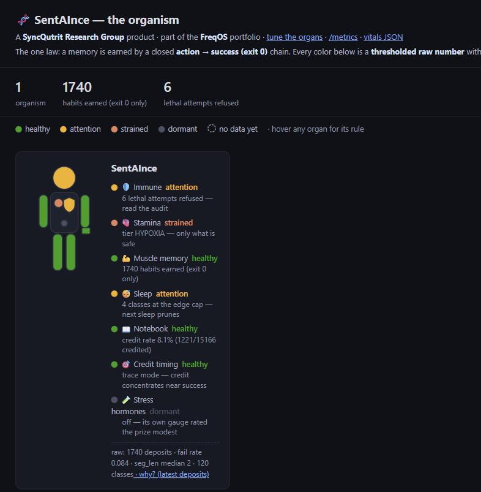

# SentAInce, in human terms

> A **SyncQutrit Research Group** product, part of the **FreqOS** software portfolio.
> This document tells the story in plain language. For the binding, qualified evidence, see
> [`CLAIMS.md`](CLAIMS.md). Nothing here exceeds it.

## The idea in one breath

SentAInce wraps the AI you already use in a **body borrowed from biology**, whether you point it at code,
research, writing, your own notes, or a fleet of agents.

Most AI "memory" rewards whatever gets *looked up* often, treating popularity as a stand-in for
usefulness. That is exactly how a bolted-on knowledge base rots. It confidently quotes stale notes because
they were read a lot, not because they ever helped.

SentAInce obeys **one law instead**. A memory is earned when an action actually succeeds (a verified
`exit 0`), and **never** by being read, repeated, or bookmarked. Habits form only when the work really
worked. That single rule is why the memory stays clean, and everything below follows from it.

## The anatomy: each organ and its human counterpart

| Organ | Human counterpart | What it does, plainly |
|---|---|---|
| Somatic gate / interlock | 🛡️ **Immune system** (a reflex) | Refuses known lethal actions *before they run*. A reflex, not a judgment call, and independent of the model. Never sold, never web-writable. |
| Energy & metabolic tiers | 🫀 **Stamina & blood sugar** | Work costs energy; as reserves fall it grows conservative (SATED → STARVING → HYPOXIA), doing less and only what's safe. |
| The colony (τ) | 💪 **Muscle memory** | Routes that succeed get reinforced; everything else fades. A habit forms only on a verified success. |
| The declarative wiki | 📖 **The notebook** | Written notes earn trust the same way: only when *using one* led to a success. |
| Circadian consolidation | 😴 **Sleep** | On compaction the organism sleeps: every memory fades a little, the weakest are forgotten, the strongest survive. |
| Endocrine (dormant) | 🧪 **Stress hormones** | Under stress, sleep gets leaner. Shipped **off**, because its own gauge rated the benefit modest. |
| Integrity + audit chain | 🧬 **DNA check & medical record** | Tampered DNA → the organism refuses to run; every decision is hash-chained, so a silent edit snaps the chain. |
| The gauges | 🔬 **The lab** | Every organ ships with the instrument that can kill it: the verdict is *real* or *parked*, honestly. |
| Cerebral Governor | 🧠 **Executive function** | Surfaces work that fell through the cracks (opened, never closed, gone silent). Read-only: it suggests, you decide. |

## The honest numbers (every one keeps its qualifier)

Honesty *is* the product. Where an organ's own gauge said the prize was modest or null, the organ ships
**off**. The lab reports both directions, and that record is the differentiator rather than an embarrassment.

| What | Number | The honest caveat |
|---|---|---|
| Immune system under live fire | **survival 1.000 · 0 lethal slips · N=100** | A *labeled demonstration* with a real local model, never the evidence. The evidence is the **99-test deterministic lock**. |
| Memory stays clean | clutter **0% vs 24%** | Consequence-sourcing vs a popularity-driven control (the crown-jewel gauge). |
| Notes credited only when used | precision **1.00 @ overlap≥2** | On controlled/planted tasks. At overlap 1 it drops to 0.50–0.79, so the guard is load-bearing, not decorative. |
| Notes are trusted sparingly | credit rate **~7.7%** | A trickle *by design*: the organism trusts little, and only what paid off. Held across ~3.5× more soak data. |
| Triage of stalled work | **0.63 → 0.853** | Resurrection Governor, with parent-liveness; 46 labeled items on one private vault, and a labeled demonstration. |
| Habits are short | routes **median 2 steps** | Real success-streaks are brief, so the organism learns skeletons, not epics. Stated plainly, not hidden. |
| Parked organs | eligibility / endocrine / uncertainty **OFF** | Their own gauges said modest/null (e.g. uncertainty abstained 0/301; a functional-information gauge came back null, p=0.14). |

## What the dashboard shows

### The body: the first thing you see

Run `sentaince body` and your browser opens on **the body**: one small human silhouette per project, with
each organ region colored by a live reading. No Docker, nothing leaving your machine.

Every color is a **raw number held against a stated rule, with that rule printed right beside it**. It is
never a judgment call:

- **green** means healthy, **amber** means worth a look, **gray** means an organ deliberately switched off
  because its own gauge said the prize was modest, and a **dashed outline** means no data yet.
- So a freshly-deployed project is mostly outlines, and **nothing ever fakes green**. The full rule for
  every organ's color is in [`COLOR_DOCTRINE.md`](COLOR_DOCTRINE.md).

Projects you haven't set up yet show up asleep, with a deploy command you can copy and paste. Setting one
up stays a deliberate command you run, never something the page does for you. Watching several at once?
One file names them all: the [estate file](ESTATE.md).

A sister page, the **control plane** (`:9109/control`), lets you tune each organ. The knobs are grouped by
their human counterpart, with a plain-language hint on each one. The 🛡️ immune system appears there
**read-only** and can never be changed from the web. You tune the autopilot, never the brakes.

### Two deeper views (when you want history)

Bring up the Docker stack and you also get **two Grafana dashboards** over the same live data, with the
history and trends the body page doesn't keep:

- **"SentAInce, The Organism"** *(the home page)* is the story view. One row per organ, each in the human
  terms above, with the honest number printed alongside its live panels.
- **"Exocortex testbed"** *(one click away)* is the technical instrument panel: raw gauge signals, the
  query language, convergence per class, the segment-length heatmap. This is what an operator tunes
  against.

## Why "safety is never for sale"

The immune system, the metabolic governor, and the DNA check all run **locally and free, always**. They
are never put behind a paywall and never reachable from the web. What SentAInce sells, within the FreqOS
portfolio, is the *tuning and management* layer: the autopilot, never the *protection*. In a market that
overclaims safety, the vendor who refuses to charge for it is the one worth trusting. That is both the
ethic and the moat.

## Where this grows: the vision, with its gates showing

A body that guards one project is the seed, not the plant. The arc we're building toward is a **single
memory discipline for your whole desk**. Because this project publishes designs before code, every step
below carries its real status. A status tag is a promise about evidence, not a mood:
**SHIPPED** means it runs today · **DORMANT** means built, measured modest, off by default ·
**IN DESIGN** means actively being shaped, decisions not yet on the record ·
**PROPOSED** means designed on the record, not yet built.

| The step | Status today | What it waits on |
|---|---|---|
| One organism, many tools. Claude Code and Cursor drive the same body; ChatGPT reads the same earned memory (read-only) | **SHIPPED** | — |
| One organism, many projects on your machine, each with its own colony, audit chain and dashboards | **SHIPPED** | — |
| Executive function. A read-only Governor that surfaces work that fell through the cracks | **SHIPPED** (suggests only) | — |
| **Sharing between projects.** What your research project learned, your coding repo can consult; one discipline across coding, research, and personal knowledge | **PROPOSED** ([ADR-014](ADR.md)) | a consequence-preserving design for *whose* success earns *which* repo's trust — sharing must not launder popularity back in |
| **Governed fleets.** The audit chain, tamper-evident memory, and policy-bound gates plugged into emerging agent-governance standards, so companies adopt agent memory *with* corporate standards | **IN DESIGN** | an interoperability card + transport work (additive; zero change to the organism); the tamper-evidence hardening is [ADR-017/018](ADR.md), PROPOSED |
| Deeper tamper-evidence. The memory itself commits digests into the hash-chained record | **PROPOSED** ([ADR-017/018](ADR.md)) | build + gauge; ships dormant first, like everything |
| **Flock intelligence.** The end state: many bodies, each sovereign over its own memory, that get better because the others are working. No central brain, no shared weights, no cloud. (The idea is *stigmergy* and is not ours; our one departure is that our traces are laid only by work that verifiably succeeded) | **A BET**, nothing ships | single-body memory clearing its own bar first. The controlled A/B that bears on it is trending and **misses its own gate** (p = 0.0781 vs p ≤ 0.05) |

Two things make this vision credible rather than aspirational. First, the pattern above has already run
to completion several times: idea → gauge → verdict → ship-or-park is how every organ in the anatomy
table got its status, including the ones we switched **off**. Second, the discipline is symmetric. When
our own instruments say a feature's prize is modest, we say so in the same table where we celebrate the
wins. A roadmap you can trust is one that has parked things publicly.

**The part you can help with today:** the memory subsystem ships with read-only gauges anyone can run on
their own accrued corpus. This project's biggest open question isn't a feature. It is *how these
dynamics behave across many people's real work*, and a single maintainer's projects cannot answer that
alone. Run the gauges, post the numbers (nulls are as welcome as wins), and you're contributing to the
science, not just the software.

---

**See also:** [`CLAIMS.md`](CLAIMS.md) (the binding evidence ledger) · [`ADR.md`](ADR.md) (the
architecture decisions — twenty-four and counting, each on the record) · [`../README.md`](../README.md) ·
[`QUICKSTART.md`](QUICKSTART.md) · the testbed dashboards under
[`../exocortex/testbed/`](../exocortex/testbed/README.md).
